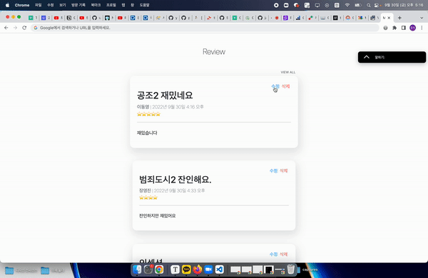
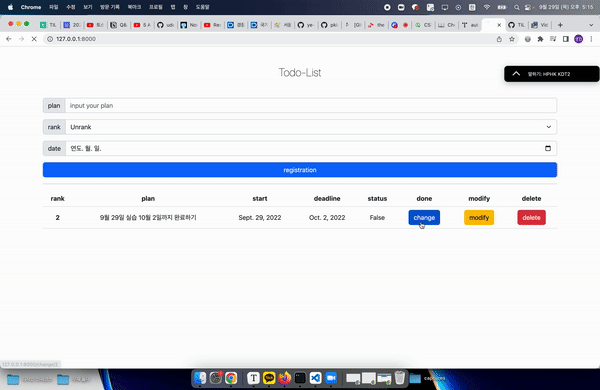
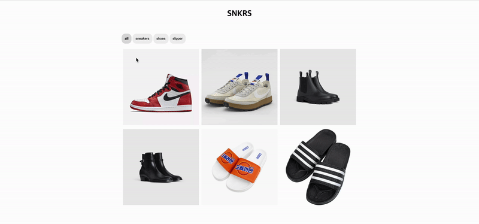
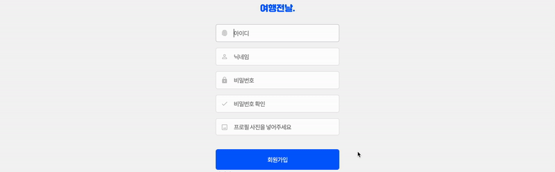
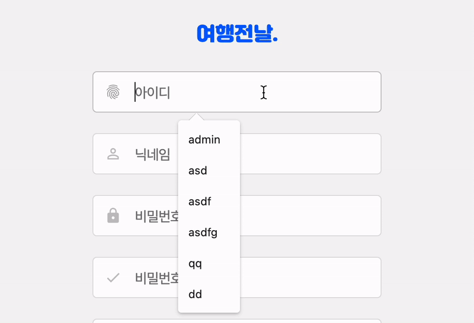
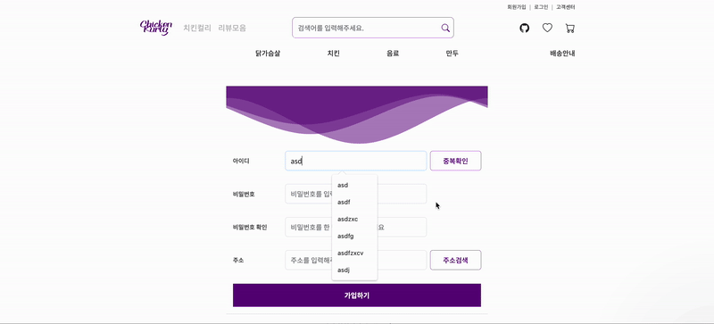

# PORTFOLIO-display

## 0. 오늘의집 + 토스피드

 

## 0-1. 치킨컬리(마켓컬리 클론)

[배포 서비스 시연](https://www.youtube.com/watch?v=9K4vOyYXk3g)

[배포 URL](http://kurly.shop/products)

 

## 0-2 프로그래머스 클론코딩(리액트)

[리액트](https://github.com/FE-campus/toy-project/pull/49)

## 1. 피어 오브 갓 판매 페이지 디자인

 

## 2. OTT 서비스 상세 페이지 디자인

 

## 3. SNS 담벼락 페이지 디자인 

 

## 4. Todo-list 디자인

 

## 5. 반응형 디자인

 

## 6. 카테고리 필터 기능

 

## 7. 회원가입 폼

 
